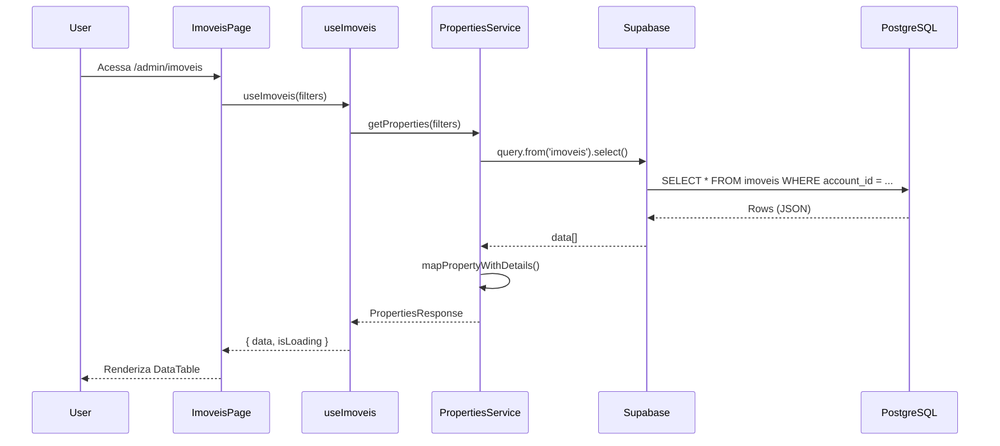
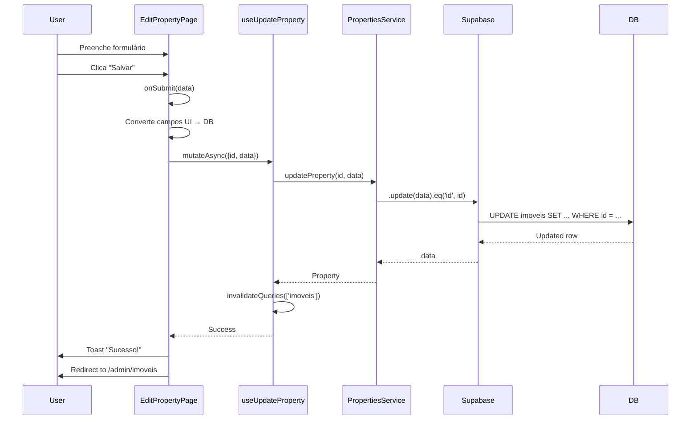

# Documentação da Página de Imóveis

**Data**: 2025-10-17
**Versão**: 1.0
**Projeto**: Moby CRM v3.0

---

## 📋 Sumário

1. [Visão Geral](#visão-geral)
2. [Arquitetura](#arquitetura)
3. [Arquivos Frontend](#arquivos-frontend)
4. [Hooks e Estado](#hooks-e-estado)
5. [Services e APIs](#services-e-apis)
6. [Banco de Dados](#banco-de-dados)
7. [Fluxo de Dados](#fluxo-de-dados)
8. [Mapeamento de Campos](#mapeamento-de-campos)

---

## 🎯 Visão Geral

O módulo de **Imóveis** é responsável pela gestão completa do portfólio de propriedades da imobiliária. Permite listar, criar, editar, visualizar e deletar propriedades com todos os seus detalhes (localização, características, valores, proprietário, etc).

### Funcionalidades Principais

- ✅ Listagem paginada de imóveis com filtros avançados
- ✅ Visualização detalhada de cada imóvel
- ✅ Edição completa de informações (5 tabs)
- ✅ Criação de novos imóveis
- ✅ Exclusão de imóveis
- ✅ Integração com Google Maps para localização
- ✅ Galeria de fotos
- ✅ Tour virtual
- ✅ SEO e marketing

---

## 🏗️ Arquitetura

```
┌─────────────────────────────────────────────────────────────┐
│                     Frontend (Next.js)                       │
├─────────────────────────────────────────────────────────────┤
│  Pages                 │  Hooks              │  Components   │
│  /admin/imoveis/       │  useImoveis.ts      │  PropertyMap  │
│  /admin/imoveis/[id]   │  useAccount.ts      │  Breadcrumb   │
│  /admin/imoveis/novo   │                     │  AdminTable   │
├─────────────────────────────────────────────────────────────┤
│                     Services Layer                           │
│                 properties.service.ts                        │
├─────────────────────────────────────────────────────────────┤
│                   Supabase Client                            │
│              lib/supabase/client.ts                          │
├─────────────────────────────────────────────────────────────┤
│                   Database (PostgreSQL)                      │
│                  Tabela: imoveis                             │
└─────────────────────────────────────────────────────────────┘
```

---

## 📁 Arquivos Frontend

### 1. Páginas (App Router - Next.js 15)

#### `/app/admin/imoveis/page.tsx`
**Função**: Página principal - listagem de imóveis
**Linhas**: 568 linhas
**Componentes principais**:
- `AdminTablePage` - Wrapper com layout padrão
- `DataTable` - Tabela com colunas configuráveis
- Filtros: cidade, bairro, tipo, status, preço
- Paginação com limite configurável

**Estrutura**:
```tsx
export default function ImoveisPage() {
  // Estado local para filtros
  const [filters, setFilters] = useState({...})

  // Hook de dados
  const { data, isLoading, isError } = useImoveis(filters)

  return (
    <AdminTablePage pageId="properties" title="Imóveis">
      <DataTable columns={columns} data={imoveis} />
    </AdminTablePage>
  )
}
```

**Colunas da tabela**:
1. Checkbox de seleção
2. Código de referência
3. Tipo (Apartamento, Casa, etc)
4. Localização (Cidade - Bairro)
5. Preço
6. Características (quartos, banheiros, m²)
7. Status
8. Ações (Visualizar, Editar, Excluir)

---

#### `/app/admin/imoveis/[id]/page.tsx`
**Função**: Página de edição de imóvel individual
**Linhas**: 507 linhas
**Tabs de edição**:
1. **Informações** - Código, título, descrição, tipo, finalidade, status
2. **Localização** - Endereço completo, coordenadas GPS
3. **Características** - Áreas, quartos, banheiros, vagas, andar
4. **Valores** - Preço venda/aluguel, condomínio, IPTU
5. **Proprietário** - Dados do dono, comissão, marketing, SEO

**Estrutura**:
```tsx
export default function EditPropertyPage({ params }) {
  const propertyId = params.id
  const { data: property, isLoading } = usePropertyById(propertyId)
  const updateProperty = useUpdateProperty()
  const deleteProperty = useDeleteProperty()

  const { register, handleSubmit, setValue, watch } = useForm()

  const onSubmit = async (data) => {
    // Converte campos UI -> colunas do banco
    const updateData = { ... }
    await updateProperty.mutateAsync({ id: propertyId, data: updateData })
  }

  return <form onSubmit={handleSubmit(onSubmit)}>...</form>
}
```

**Conversões importantes**:
- `purpose` (UI) → `loc_venda` (banco): "sale"→"venda", "rent"→"locacao"
- `latitude/longitude` (number) → `lat/long` (TEXT no banco)
- `total_area` (UI) → `m2` (banco)
- `parking_spaces` (UI) → `vagas_garagem` (banco)

---

#### `/app/admin/imoveis/novo/page.tsx`
**Função**: Página de criação de novo imóvel
**Estrutura**: Similar à página de edição, mas com formulário vazio

---

#### `/app/admin/imoveis/components/PropertyMap.tsx`
**Função**: Componente de mapa (Google Maps) para visualizar localização
**Props**:
- `latitude: number`
- `longitude: number`
- `address: string`

---

### 2. Componentes Auxiliares

#### `/components/navigation/breadcrumb-nav.tsx`
**Função**: Navegação breadcrumb
**Configuração para imóveis**:
```typescript
const pathMapping: Record<string, BreadcrumbItem[]> = {
  '/admin/imoveis': [
    { label: 'Dashboard', href: '/admin/dashboard' },
    { label: 'Imóveis' }
  ],
  '/admin/imoveis/[id]': [
    { label: 'Dashboard', href: '/admin/dashboard' },
    { label: 'Imóveis', href: '/admin/imoveis' },
    { label: 'Editar' }
  ]
}
```

#### `/components/admin/AdminTablePage.tsx`
**Função**: Layout wrapper para páginas admin com tabela
**Features**:
- Loading skeleton
- Empty state
- Error handling
- Header com título e ações
- Breadcrumb automático

---

## 🪝 Hooks e Estado

### `/hooks/useImoveis.ts`
**Linhas**: 600+ linhas
**Hooks exportados**:

#### 1. `useImoveis(filters?: PropertyFilter)`
**Retorna**: `{ data, isLoading, isError, error }`
**Descrição**: Hook principal para buscar lista de imóveis com filtros
**React Query**: `queryKey: ['imoveis', filters, account?.id]`

```typescript
export function useImoveis(filters: PropertyFilter = {}) {
  const { account } = useAccount()

  return useQuery({
    queryKey: ['imoveis', filters, account?.id],
    queryFn: async () => {
      const serviceFilters = {
        min_price: filters.minPrice || filters.minValor,
        min_bedrooms: filters.minBedrooms || filters.minQuartos,
        // ... mapeamento de filtros
      }

      const result = await propertiesService.getProperties(serviceFilters)
      return {
        imoveis: result.properties,
        properties: result.properties,
        count: result.total
      }
    },
    enabled: true
  })
}
```

---

#### 2. `usePropertyById(id: string)`
**Retorna**: `{ data, isLoading, isError }`
**Descrição**: Busca um imóvel específico por ID
**React Query**: `queryKey: ['imovel', id]`

```typescript
export function usePropertyById(id: string) {
  return useQuery({
    queryKey: ['imovel', id],
    queryFn: async () => {
      const property = await propertiesService.getProperty(id)
      if (!property) throw new Error('Property not found')
      return property
    },
    enabled: !!id
  })
}
```

---

#### 3. `useUpdateProperty()`
**Retorna**: `useMutation` object
**Descrição**: Mutation para atualizar imóvel
**Invalidates**: `['properties']`, `['imoveis']`, `['property']`, `['imovel']`

```typescript
export function useUpdateProperty() {
  const queryClient = useQueryClient()

  return useMutation({
    mutationFn: async ({ id, data }: { id: string; data: PropertyUpdate }) => {
      const property = await propertiesService.updateProperty(id, data)
      return property
    },
    onSuccess: () => {
      queryClient.invalidateQueries({ queryKey: ['properties'] })
      queryClient.invalidateQueries({ queryKey: ['imoveis'] })
      toast({ title: 'Sucesso!', description: 'Imóvel atualizado' })
    }
  })
}
```

---

#### 4. `useDeleteProperty()`
**Retorna**: `useMutation` object
**Descrição**: Mutation para deletar imóvel

---

#### 5. `useCreateImovel()`
**Retorna**: `useMutation` object
**Descrição**: Mutation para criar novo imóvel

---

### `/hooks/useAccount.ts`
**Função**: Gerencia conta/organização do usuário logado
**Usado em**: Filtros por `account_id` nas queries

---

## 🔌 Services e APIs

### `/lib/services/properties.service.ts`
**Linhas**: 1100+ linhas
**Classe**: `PropertiesService` (singleton)

#### Métodos Principais:

##### 1. `getProperties(filters?: PropertyFilters): Promise<PropertiesResponse>`
**Descrição**: Busca lista de propriedades com filtros e paginação
**Filtros suportados**:
- `status` - Status do imóvel
- `type` - Tipo (apartamento, casa, etc)
- `location` - Busca em cidade ou bairro
- `min_price` / `max_price` - Faixa de preço
- `bedrooms` - Número de quartos
- `bathrooms` - Número de banheiros
- `min_area` / `max_area` - Faixa de área
- `search` - Busca textual
- `page` / `limit` - Paginação
- `sort_by` / `sort_order` - Ordenação

**Query Supabase**:
```typescript
let query = supabase
  .from('imoveis')
  .select('*', { count: 'exact' })
  .eq('account_id', accountId)

// Aplica filtros
if (min_price) query = query.gte('valor', min_price)
if (bedrooms) query = query.eq('quartos', bedrooms)
// ...

// Ordenação e paginação
query = query.order(sort_by, { ascending })
query = query.range(offset, offset + limit - 1)

const { data, error, count } = await query
```

**Retorno**:
```typescript
{
  properties: PropertyWithDetails[],
  total: number,
  page: number,
  limit: number,
  total_pages: number
}
```

---

##### 2. `getProperty(propertyId: string): Promise<PropertyWithDetails | null>`
**Descrição**: Busca imóvel específico por ID

```typescript
const { data, error } = await supabase
  .from('imoveis')
  .select('*')
  .eq('id', propertyId)
  .eq('account_id', accountId)
  .single()
```

---

##### 3. `updateProperty(propertyId: string, updates: Partial<PropertyUpdate>): Promise<Property>`
**Descrição**: Atualiza imóvel existente

```typescript
const { data, error } = await supabase
  .from('imoveis')
  .update(updates)
  .eq('id', propertyId)
  .eq('account_id', accountId)
  .select()
  .single()
```

---

##### 4. `createProperty(propertyData: Partial<PropertyInsert>): Promise<Property>`
**Descrição**: Cria novo imóvel

---

##### 5. `deleteProperty(propertyId: string): Promise<void>`
**Descrição**: Deleta imóvel (soft delete com `archived: true`)

---

##### 6. `mapPropertyWithDetails(property: any): PropertyWithDetails`
**Descrição**: Função privada que mapeia colunas do banco para interface UI
**Conversões**:
- `descricao` → `title`, `description`
- `bairro` → `neighborhood`
- `cidade` → `city`
- `lat/long` (TEXT) → `latitude/longitude` (number)
- `m2` → `total_area`
- `quartos` → `bedrooms`
- `banheiros` → `bathrooms`
- `vagas_garagem` → `parking_spaces`
- `loc_venda` → `purpose` (sale/rent)
- `valor` → `sale_price` ou `rent_price`
- `condominio_mensal` → `condo_fee`
- `iptu_mensal` → `iptu`

---

### `/lib/supabase/client.ts`
**Função**: Cliente Supabase configurado
**Exports**:
- `supabase` - Cliente configurado
- `getUserAccountId()` - Pega account_id do usuário logado

```typescript
export async function getUserAccountId(): Promise<string | null> {
  const { data: { user } } = await supabase.auth.getUser()
  if (!user) return null

  const { data } = await supabase
    .from('users')
    .select('account_id')
    .eq('id', user.id)
    .single()

  return data?.account_id || null
}
```

---

## 🗄️ Banco de Dados

### Supabase Project
- **Project ID**: `blxizomghhysmuvvkxls`
- **Database**: PostgreSQL
- **Schema**: `public`

### Tabela: `imoveis`

**Total de colunas**: 36 colunas
**Primary Key**: `id` (uuid)
**Foreign Keys**:
- `account_id` → `accounts.id`
- `proprietario_id` → `contacts.id` (opcional)

#### Schema Completo:

```sql
CREATE TABLE public.imoveis (
  -- Identificação
  id UUID PRIMARY KEY DEFAULT uuid_generate_v4(),
  account_id UUID NOT NULL REFERENCES accounts(id),
  codigo_referencia TEXT,

  -- Informações Básicas
  titulo TEXT,
  descricao TEXT,
  tipo TEXT, -- apartment, house, commercial, land, rural
  loc_venda TEXT, -- venda, locacao, ambos
  status TEXT, -- available, reserved, sold, rented, unavailable

  -- Localização
  rua TEXT,
  numero VARCHAR(20),
  complemento TEXT,
  bairro TEXT,
  cidade TEXT,
  estado VARCHAR(2),
  cep VARCHAR(10),
  lat TEXT, -- Latitude (TEXT para precisão)
  long TEXT, -- Longitude (TEXT para precisão)

  -- Características Físicas
  m2 SMALLINT, -- Área total
  area_construida NUMERIC,
  area_terreno NUMERIC,
  quartos SMALLINT,
  banheiros SMALLINT,
  suites SMALLINT,
  vagas_garagem SMALLINT,
  garagem BOOLEAN, -- Legacy (usar vagas_garagem)
  andar SMALLINT,

  -- Valores Financeiros
  valor NUMERIC, -- Preço principal
  condominio_mensal NUMERIC,
  iptu_mensal NUMERIC,
  comissao_percentual NUMERIC,

  -- Mídia
  foto TEXT, -- URL da foto principal
  galeria_fotos TEXT[], -- Array de URLs
  video_url TEXT,
  tour_virtual_url TEXT,

  -- Proprietário
  proprietario_id UUID REFERENCES contacts(id),
  proprietario_nome TEXT,
  proprietario_telefone VARCHAR(20),
  proprietario_email VARCHAR(255),

  -- Extras
  caracteristicas JSONB, -- {piscina: true, churrasqueira: true, etc}
  documentacao_ok BOOLEAN,
  aceita_permuta BOOLEAN,
  aceita_financiamento BOOLEAN,

  -- SEO / Marketing
  meta_titulo TEXT,
  meta_descricao TEXT,
  site TEXT, -- Portal de origem (OLX, VivaReal, etc)

  -- Controle
  archived BOOLEAN DEFAULT false,
  created_at TIMESTAMPTZ DEFAULT NOW(),
  updated_at TIMESTAMPTZ DEFAULT NOW()
);

-- Índices
CREATE INDEX idx_imoveis_account_id ON imoveis(account_id);
CREATE INDEX idx_imoveis_cidade ON imoveis(cidade);
CREATE INDEX idx_imoveis_bairro ON imoveis(bairro);
CREATE INDEX idx_imoveis_tipo ON imoveis(tipo);
CREATE INDEX idx_imoveis_status ON imoveis(status);
CREATE INDEX idx_imoveis_valor ON imoveis(valor);
```

---

#### Policies (RLS - Row Level Security)

**Status**: ❌ DESABILITADO (para modo demo)

```sql
-- RLS foi desabilitado para permitir acesso em modo mock
ALTER TABLE imoveis DISABLE ROW LEVEL SECURITY;
```

**Policies originais** (quando RLS estava ativo):
1. `Users can view properties in their account` - SELECT
2. `Users can create properties in their account` - INSERT
3. `Users can update properties in their account` - UPDATE
4. `Admins can delete properties in their account` - DELETE
5. `Public can view public properties` - SELECT (quando público)

**Função auxiliar**:
```sql
CREATE FUNCTION get_user_account_id() RETURNS uuid AS $$
  SELECT account_id FROM public.users WHERE id = auth.uid()
$$ LANGUAGE sql STABLE SECURITY DEFINER;
```

---

## 🔄 Fluxo de Dados

### 1. Listagem de Imóveis



---

### 2. Edição de Imóvel



---

## 🗺️ Mapeamento de Campos

### Interface UI ↔️ Banco de Dados

| Campo UI              | Tipo UI    | Coluna Banco          | Tipo DB      | Conversão                           |
|-----------------------|------------|-----------------------|--------------|-------------------------------------|
| `id`                  | string     | `id`                  | uuid         | Direto                              |
| `code`                | string     | `codigo_referencia`   | text         | Direto                              |
| `title`               | string     | `titulo`              | text         | Fallback: `descricao`               |
| `description`         | string     | `descricao`           | text         | Direto                              |
| `type`                | string     | `tipo`                | text         | Direto (apartment/house/etc)        |
| `purpose`             | string     | `loc_venda`           | text         | sale→venda, rent→locacao            |
| `status`              | string     | `status`              | text         | Direto (available/sold/etc)         |
| `neighborhood`        | string     | `bairro`              | text         | Direto                              |
| `city`                | string     | `cidade`              | text         | Direto                              |
| `state`               | string     | `estado`              | varchar(2)   | Direto (SP, RJ, etc)                |
| `address.street`      | string     | `rua`                 | text         | Direto                              |
| `address.number`      | string     | `numero`              | varchar(20)  | Direto                              |
| `address.complement`  | string     | `complemento`         | text         | Direto                              |
| `address.zipCode`     | string     | `cep`                 | varchar(10)  | Direto                              |
| `latitude`            | number     | `lat`                 | text         | parseFloat() ← toString()           |
| `longitude`           | number     | `long`                | text         | parseFloat() ← toString()           |
| `total_area`          | number     | `m2`                  | smallint     | parseInt()                          |
| `built_area`          | number     | `area_construida`     | numeric      | parseFloat()                        |
| `land_area`           | number     | `area_terreno`        | numeric      | parseFloat()                        |
| `bedrooms`            | number     | `quartos`             | smallint     | parseInt()                          |
| `suites`              | number     | `suites`              | smallint     | parseInt()                          |
| `bathrooms`           | number     | `banheiros`           | smallint     | parseInt()                          |
| `parking_spaces`      | number     | `vagas_garagem`       | smallint     | parseInt()                          |
| `floor`               | number     | `andar`               | smallint     | parseInt()                          |
| `sale_price`          | number     | `valor`               | numeric      | parseFloat() (se purpose=sale)      |
| `rent_price`          | number     | `valor`               | numeric      | parseFloat() (se purpose=rent)      |
| `condo_fee`           | number     | `condominio_mensal`   | numeric      | parseFloat()                        |
| `iptu`                | number     | `iptu_mensal`         | numeric      | parseFloat()                        |
| `owner_name`          | string     | `proprietario_nome`   | text         | Direto                              |
| `owner_phone`         | string     | `proprietario_telefone`| varchar(20) | Direto                              |
| `owner_email`         | string     | `proprietario_email`  | varchar(255) | Direto                              |
| `commission`          | number     | `comissao_percentual` | numeric      | parseFloat()                        |
| `virtual_tour_url`    | string     | `tour_virtual_url`    | text         | Direto                              |
| `meta_title`          | string     | `meta_titulo`         | text         | Direto                              |
| `meta_description`    | string     | `meta_descricao`      | text         | Direto                              |
| `site`                | string     | `site`                | text         | Direto                              |
| `images`              | array      | `galeria_fotos`       | text[]       | Array de URLs                       |
| `created_at`          | string     | `created_at`          | timestamptz  | ISO 8601                            |
| `updated_at`          | string     | `updated_at`          | timestamptz  | ISO 8601                            |

---

### Conversões Especiais

#### 1. **Purpose (Finalidade)**
```typescript
// UI → Banco
let loc_venda = 'venda'
if (data.purpose === 'rent') loc_venda = 'locacao'
else if (data.purpose === 'both') loc_venda = 'ambos'

// Banco → UI
const purpose = loc_venda === 'venda' ? 'sale'
              : loc_venda === 'locacao' ? 'rent'
              : 'sale'
```

#### 2. **Coordenadas (Latitude/Longitude)**
```typescript
// UI → Banco (number → TEXT)
lat: data.latitude ? data.latitude.toString() : null
long: data.longitude ? data.longitude.toString() : null

// Banco → UI (TEXT → number)
latitude: property.lat ? parseFloat(property.lat) : undefined
longitude: property.long ? parseFloat(property.long) : undefined
```

#### 3. **Preço (Sale/Rent)**
```typescript
// UI → Banco (um único campo `valor`)
valor: data.sale_price || data.rent_price ?
       parseFloat(data.sale_price || data.rent_price) : null

// Banco → UI (deriva sale_price e rent_price de loc_venda + valor)
sale_price: loc_venda === 'venda' || loc_venda === 'ambos'
            ? parseFloat(property.valor) : undefined
rent_price: loc_venda === 'locacao' || loc_venda === 'ambos'
            ? parseFloat(property.valor) : undefined
```

#### 4. **Garagem**
```typescript
// UI → Banco
vagas_garagem: data.parking_spaces ? parseInt(data.parking_spaces) : null
garagem: data.parking_spaces > 0

// Banco → UI
parking_spaces: property.vagas_garagem || (property.garagem ? 1 : 0)
```

---

## 📊 Estatísticas do Código

| Métrica                | Valor    |
|------------------------|----------|
| Total de arquivos      | 8+       |
| Linhas de código       | 3.000+   |
| Hooks customizados     | 5        |
| Métodos do service     | 15+      |
| Colunas do banco       | 36       |
| Filtros disponíveis    | 10+      |
| Tabs de edição         | 5        |
| Campos de formulário   | 35+      |

---

## 🔒 Segurança

### Modo Atual: Demo (RLS Desabilitado)
- ✅ RLS desabilitado na tabela `imoveis`
- ✅ Permite acesso em modo mock (sem auth.uid())
- ⚠️ **Não usar em produção sem reativar RLS!**

### Modo Produção (Quando RLS ativo):
- ✅ Row Level Security por `account_id`
- ✅ Função `get_user_account_id()` para auth
- ✅ Policies de INSERT/UPDATE/DELETE por role
- ✅ Public properties com setting

### Reativar RLS:
```sql
ALTER TABLE imoveis ENABLE ROW LEVEL SECURITY;
```

---

## 🚀 Performance

### Otimizações Implementadas:

1. **React Query Caching**
   - Cache automático de 5 minutos
   - Stale time configurado
   - Invalidação inteligente

2. **Índices de Banco**
   - `account_id` (mais importante)
   - `cidade`, `bairro` (para filtros)
   - `tipo`, `status` (para filtros)
   - `valor` (para range queries)

3. **Paginação**
   - Limit padrão: 20 itens
   - Range queries eficientes
   - Count separado

4. **Lazy Loading**
   - Imagens carregadas sob demanda
   - Tab content renderizado apenas quando ativo

---

## 🐛 Troubleshooting

### Problema: Imóveis não aparecem na listagem
**Causa**: `account_id` incompatível ou RLS bloqueando
**Solução**:
1. Verificar `account_id` no console
2. Confirmar RLS status: `SELECT tablename, rowsecurity FROM pg_tables WHERE tablename = 'imoveis'`
3. Se necessário, desabilitar RLS ou corrigir account_id

### Problema: Erro ao salvar formulário
**Causa**: Tipo de dado incompatível ou campo obrigatório NULL
**Solução**:
1. Verificar conversões de tipo (number ↔️ TEXT)
2. Garantir campos obrigatórios preenchidos
3. Checar logs do Supabase

### Problema: Coordenadas não salvam
**Causa**: `lat`/`long` são TEXT no banco, não NUMERIC
**Solução**: Converter para string antes de salvar:
```typescript
lat: data.latitude ? data.latitude.toString() : null
```

---

## 📝 Changelog

### v1.0 (2025-10-17)
- ✅ Removida seção de parcelamento (não existe no banco)
- ✅ Criadas 12 novas colunas (endereço, proprietário, SEO)
- ✅ Atualizado mapeamento completo UI ↔️ Banco
- ✅ Corrigidas conversões de tipo TypeScript
- ✅ RLS desabilitado para modo demo
- ✅ Documentação completa criada

---

## 🎯 Próximos Passos

### Features Planejadas:
- [ ] Upload de múltiplas fotos
- [ ] Integração com APIs de portais (VivaReal, OLX)
- [ ] Geolocalização automática por CEP
- [ ] Relatórios e analytics de imóveis
- [ ] Comparador de imóveis
- [ ] Tour virtual 360°
- [ ] WhatsApp integration para compartilhar

### Melhorias Técnicas:
- [ ] Reativar RLS para produção
- [ ] Implementar testes unitários
- [ ] Adicionar validação Zod nos forms
- [ ] Otimizar queries com select específico
- [ ] Implementar cache Redis
- [ ] Adicionar logs de auditoria

---

## 📚 Referências

- [Next.js 15 Documentation](https://nextjs.org/docs)
- [Supabase Documentation](https://supabase.com/docs)
- [React Query (TanStack Query)](https://tanstack.com/query)
- [shadcn/ui Components](https://ui.shadcn.com)
- [PostgreSQL Documentation](https://www.postgresql.org/docs/)

---

**Documentação mantida por**: Claude Code
**Última atualização**: 2025-10-17
**Versão do projeto**: Moby CRM v3.0
